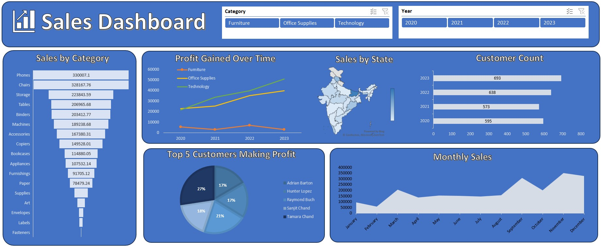

# Sales Dashboard Project

  

---

## 📌 Project Overview
This is an interactive **Sales Dashboard** designed to track sales performance, profit trends, and customer insights. It empowers business stakeholders to analyze data across different product categories, regions (India), and time periods to make strategic, data-driven decisions.

---

## 📊 Dashboard Visualizations & Key Insights

The dashboard is structured into the following key sections:

### 1. Filters / Slicers (Top Section)
* **Category Slicer:** Allows filtering the entire dashboard by major product categories (*Furniture, Office Supplies, Technology*).
* **Year Slicer:** Enables time-period analysis across the years 2020, 2021, 2022, and 2023.

### 2. Performance Metrics & Charts

* **Sales by Sub-Category (Funnel/Bar Chart):** 
    * Displays sub-category sales performance in descending order.
    * **Phones** (330,007.1) and **Chairs** (328,167.76) stand out as the top revenue-generating products.
* **Profit Gained Over Time (Line Chart):**
    * Tracks category-wise profit trends from 2020 to 2023.
    * *Technology* and *Office Supplies* show consistent upward growth, whereas *Furniture* remains relatively flat with lower profit margins.
* **Sales by State (Geographical Map):**
    * A choropleth map of India highlighting regional revenue distribution based on color intensity.
* **Customer Count (Horizontal Bar Chart):**
    * Represents the year-over-year active customer base growth, successfully peaking at **693** customers in 2023.
* **Top 5 Customers Making Profit (Pie Chart):**
    * Break down of the highest profit-contributing customers. **Tamara Chand** leads the group with the largest share at 27%.
* **Monthly Sales (Area Chart):**
    * Illustrates the monthly sales distribution over the year. Notable peaks are observed in **September** and **November**, indicating high seasonality trends (e.g., festive or end-of-year shopping seasons).

---

## 🛠️ Tech Stack Used
* **Data Visualization Tool:** Microsoft Power BI / Tableau
* **Map Provider:** Bing Maps (Geonames, Microsoft)
* **Data Source:** Sales & Financials Dataset (2020-2023)

---

## 🚀 Key Business Takeaways
1. **Top Revenue Drivers:** Phones and Chairs are the core pillars of total sales and require optimal inventory management.
2. **Profit Optimization:** The Technology sector shows the strongest growth potential. Conversely, strategic changes or cost-cutting measures are needed for the Furniture category to improve margins.
3. **Seasonality Readiness:** Significant sales spikes in March, September, and November suggest a strong seasonal push, which should guide marketing campaigns and stock readiness.

---

## 📂 How to View the Project
1. Clone this repository to your local machine.
2. Ensure `Dashboard.jpg` and `README.md` remain in the same directory directory for the image to display correctly.
3. Open the main project file (`.pbix` or equivalent extension) in your respective visualization tool.
4. Interact with the slicers to filter and deep dive into the historical data.